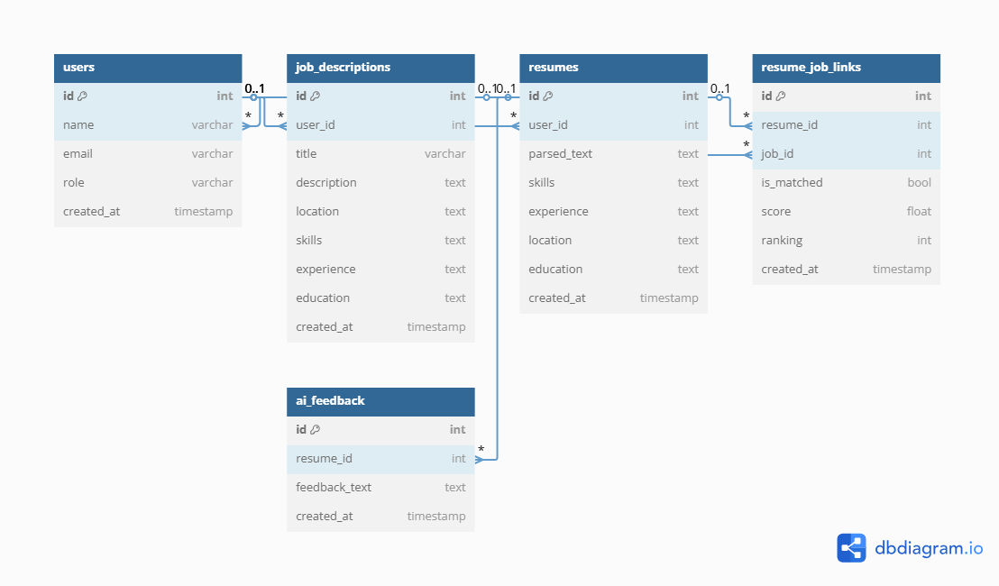

# AI-Powered Resume Screener

## Overview
The AI-powered resume screener automates resume screening by extracting key information, matching candidates with job descriptions, and ranking applicants based on relevance. It also utilizes a **free AI API** to **rerank the top 5 candidates** and **provide feedback** upon request.

## Features

### Core Features
- 🏢 **HR uploads job descriptions.**
- 📄 **Applicants upload resumes** (PDF/DOCX ).
- 🔍 **AI extracts skills, experience, and education.**
- 📊 **AI ranks resumes based on job relevance using similarity measures through comparing embedding of job description and resume.**
- 🤖 **Top 5 resumes are reranked using an AI API.**
- 📌 **HR retrieves ranked applicants.**
- ✍️ **AI-generated resume feedback upon request.**

### Optional Features
- 📢 **Resume improvement suggestions.**
- 🛠️ **Filters for custom ranking use Strategy Based Behavioural Design Pattern for Scalability and filter based on** (experience, skills,Location,etc).
- 🔗 **API for external HR systems.**

## System Architecture & Technologies

### Architecture Overview
- **Frontend:** 🖥️ Next.js (React-based UI)
- **Backend:** 🚀 FastAPI (Python-based API service)
- **Database:** 🗄️ PostgreSQL (Supabase for hosting)
- **AI Engine:**
  - 🧠 NLP-based resume parser using **SpaCy & Sentence-BERT**
  - 🤖 **Free AI API** for **reranking top 5 resumes** & **providing feedback**
- **Storage:** Extracted resume info stored in DB (**No file storage**)
- **Deployment:** 🚀 Vercel (Frontend), Railway (Backend & Job Queue)

### **System Architecture Diagram**
📌 _(To be added)_

## Database Schema

### Tables
| Table Name         | Description                   |
|--------------------|-----------------------------|
| `users`           | Stores HR & Applicants info  |
| `job_descriptions` | Stores job postings         |
| `resumes`          | Extracted resume data       |
| `Resume_job_links` | AI-ranked results           |
| `ai_feedback`     | AI-generated resume feedback |

### Relationship Types

| Entity 1          | Entity 2          | Relationship Type  |
|-------------------|-------------------|--------------------|
| Users             | Job Descriptions  | One-to-Many        |
| Users             | Resumes           | One-to-Many        |
| Resumes           | Job Descriptions  | Many-to-Many       |
| Resumes           | AI Feedback       | One-to-One        |
| Resumes           | Resumes_job_links  | Many-to-Many       |
| Job Descriptions  | Resumes_job_links  | Many-to-Many       |

### **ER Diagram**

## API Endpoints

| Method | Endpoint                          | Description                           |
|--------|-----------------------------------|---------------------------------------|
| `POST` | `/register`                       | Create HR or applicant account       |
| `POST` | `/upload_job_description`         | HR uploads job description           |
| `POST` | `/upload_resume`                  | Applicant uploads resume             |
| `GET`  | `/get_matched_resumes/{job_id}`   | Retrieve ranked resumes for a job    |
| `GET`  | `/rerank_top_5/{job_id}`          | AI API reranks top 5 resumes        |
| `GET`  | `/get_resume_feedback/{resume_id}`| AI feedback on a resume              |

### **UML Sequence Diagram**
📌 _(To be added)_

## AI Pipeline

### **Workflow**
1. 📂 **Extract text** from resume (PDF/DOCX parsing using PyMuPDF & python-docx)
2. 🏷 **Extract skills & experience** (NLP with SpaCy & Named Entity Recognition)
3. 🔢 **Convert text into embeddings** (Sentence-BERT & FAISS for similarity search)
4. 📏 **Compute cosine similarity** between resume & job description
5. 📊 **Select top 5 candidates** based on similarity score
6. 🔗 **Send top 5 to AI API** for **reranking** based on a **crafted prompt**
7. 📝 **Store AI-generated ranking & feedback**

### **AI Flowchart**
📌 _(To be added)_

